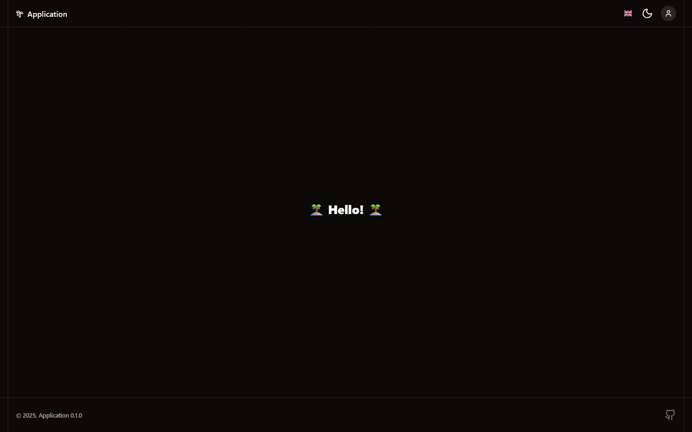
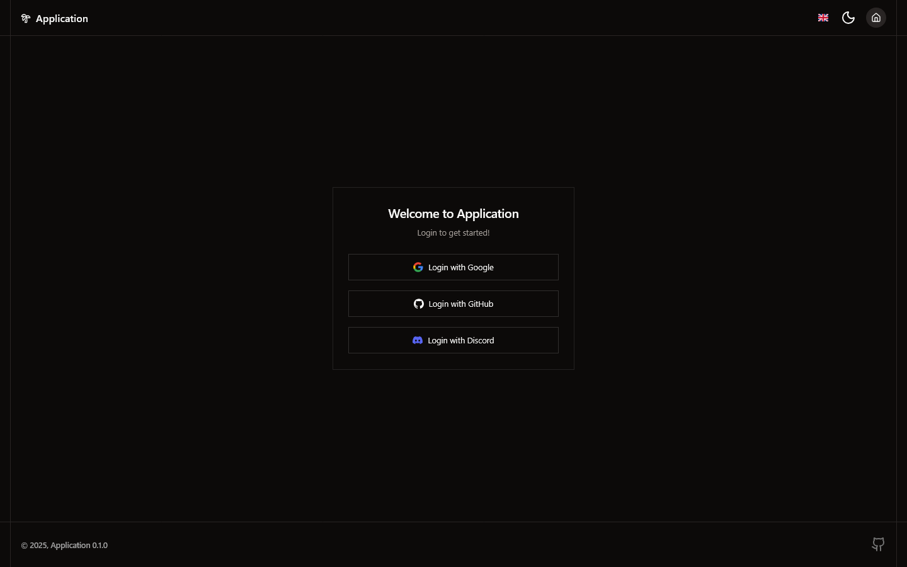
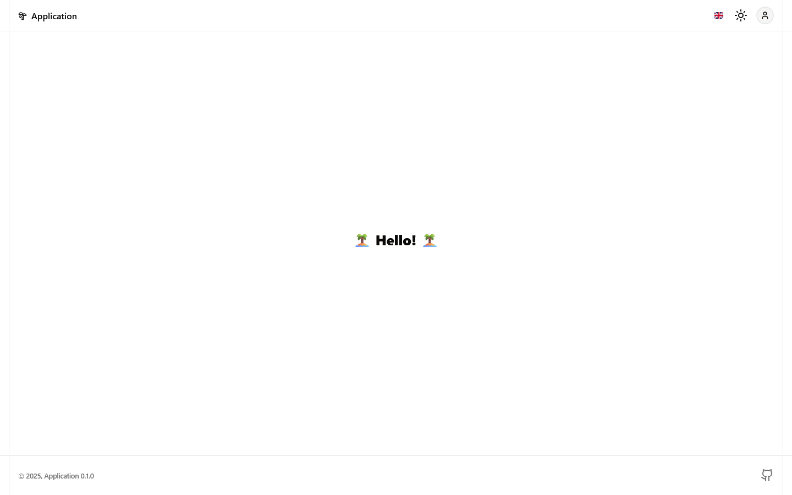
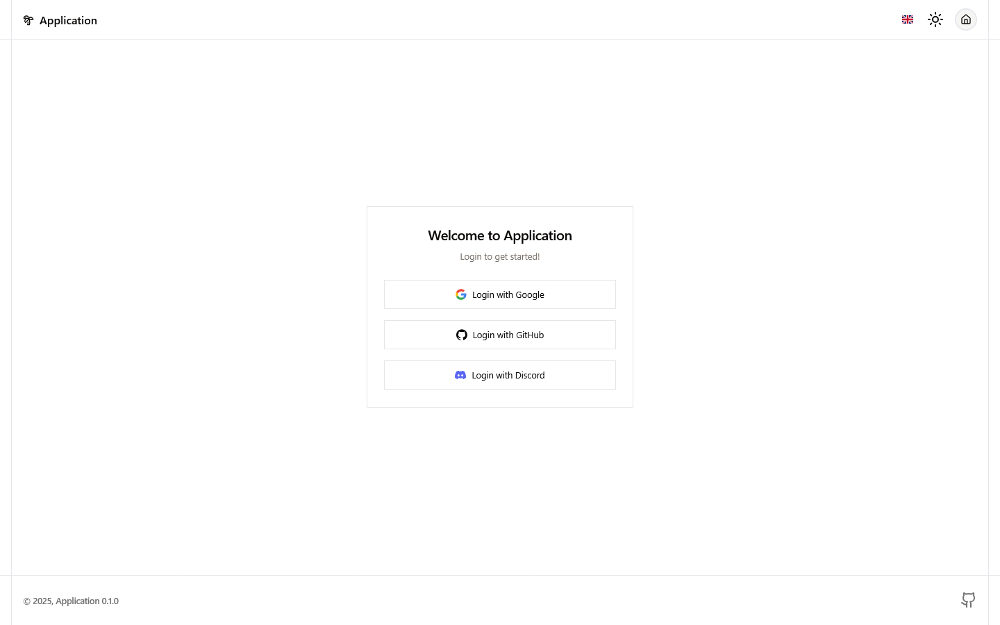

# 🏝️ TanStack-Starter

## Overview

Full-stack starter template for [`TanStack Start`](https://tanstack.com/start/latest) with batteries included: authentication, database, localization, UI components, and SSR. View the live demo at [tanstack-starter.dev](https://tanstack-starter.dev). This template is designed to skip the boilerplate of starting a new project.

This template includes the following:

- [`tanstack-start`](https://tanstack.com/start/latest)
- [`drizzle-orm`](https://orm.drizzle.team)
- [`better-auth`](https://www.better-auth.com)
- [`shadcn/ui`](https://ui.shadcn.com/)
- [`paraglide`](https://inlang.com/m/gerre34r/library-inlang-paraglideJs)
- [`resend`](https://resend.com)
- [`nitro`](https://nitro.build)
- [`vite`](https://vite.dev)

## Development

To get started, see the [`quick-start`](./docs/development/quick-start.md) guide. This project uses [`pnpm`](https://www.npmjs.com/package/pnpm), though any package manager will work. For specific development commands, refer to one of the following:

- [`npm`](./docs/commands/npm.md)
- [`bun`](./docs/commands/bun.md)
- [`pnpm`](./docs/commands/pnpm.md)
- [`deno`](./docs/commands/deno.md)
- [`docker`](./docs/commands/docker.md)

---

**Better Auth Organization Support**

> See [this issue](https://github.com/jackytea/tanstack-starter/issues/1) for details on implementing [organizations](https://better-auth.com/docs/plugins/organization).
This feature has been removed in this [`commit`](https://github.com/jackytea/tanstack-starter/commit/ea88170cbfe7c15083bce5484baa3ece2992e877), as this template is focused on generic use cases.

---

## Screenshots

**Home Page (Dark Theme)**

**Login Page (Dark Theme)**

**Home Page (Light Theme)**

**Login Page (Light Theme)**

## Contributors

 - [`jackytea`](https://github.com/jackytea)

## References

- [`TanStack/router`](https://github.com/TanStack/router)
- [`mugnavo/tanstarter`](https://github.com/mugnavo/tanstarter)
